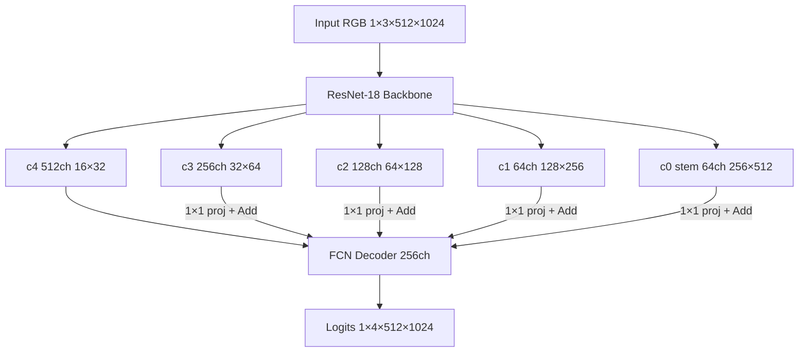

# DLALaneNet — Technical Overview (Team Brief)

**Target platform:** NVIDIA DRIVE Orin, DRIVE OS 6.0.10, TensorRT 8.6.13, **DLA 2.0 only** (no iGPU fallback)  
**Task:** Multi-class dense lane segmentation (pixel-wise class mask)  
**Deployment precision:** INT8 (calibrated in TensorRT; weights trained in FP32)

---

## 1. Problem definition


| Item      | Value                                                               |
| --------- | ------------------------------------------------------------------- |
| Input     | RGB image, static shape `**[1, 3, 512, 1024]`** (NCHW)              |
| Output    | Per-pixel class logits `**[1, 4, 512, 1024]**` — single tensor only |
| Inference | `argmax` over channel dim → class ID per pixel                      |
| Classes   | 0=background, 1=solid, 2=dotted, 3=other                            |


The network predicts a **semantic segmentation mask**, not polylines. Downstream can skeletonize / fit splines if needed.

---

## 2. Loss function (training)

### Primary loss: pixel-wise cross-entropy

```python
loss = nn.CrossEntropyLoss()(logits, target_mask)
```


| Property         | Detail                                                          |
| ---------------- | --------------------------------------------------------------- |
| Type             | `torch.nn.CrossEntropyLoss` (softmax + NLL, numerically stable) |
| `logits`         | `[B, 4, H, W]` raw scores from model                            |
| `target_mask`    | `[B, H, W]` integer class IDs in `{0,1,2,3}`                    |
| Auxiliary losses | **None** — by design for DLA (no extra outputs)                 |
| Class weights    | Not used currently (can add if class imbalance hurts)           |


**Why no auxiliary / deep supervision?**  
TensorRT INT8 on DRIVE OS 6.0.10 fuses layers best when **only the final output** is exposed. Intermediate heads would add outputs and often block fusion / force GPU–DLA splits.

**Inference:** Cross-entropy is training-only. On Orin, TensorRT engine outputs logits; application applies `argmax` (or calibrated softmax if needed for confidence).

### Optimizer & schedule


| Hyperparameter  | Default                                                  |
| --------------- | -------------------------------------------------------- |
| Optimizer       | AdamW (`lr=1e-3`, `weight_decay=1e-4`)                   |
| LR schedule     | Cosine annealing over epochs                             |
| AMP             | Enabled on CUDA (memory only; exported weights are FP32) |
| Effective batch | `batch_size × accum_steps` (default 2×2 = 4)             |


**Training settings do not change the deployed graph** — only checkpoint weights.

---

## 3. Network architecture

**Name:** `DLALaneSegNet`  
**Style:** ResNet-18 encoder + shallow FCN decoder (~16.7M parameters)

### 3.1 High-level dataflow




### 3.2 Encoder (ResNet-18)

Standard ImageNet-style stem and stages — **DLA-safe ops only:**

- `Conv2d` 7×7, stride 2  
- `BatchNorm` + `ReLU`  
- `MaxPool` 3×3, stride 2  
- 4 stages × 2 `BasicBlock` each (3×3 conv, BN, ReLU, **residual Add**)

**Not used:** dilated conv, attention, depthwise-separable custom blocks, NonMaxSuppression inside network.

### 3.3 Decoder (shallow FCN)


| Stage | Operation                                      | Spatial size (H×W) |
| ----- | ---------------------------------------------- | ------------------ |
| Start | 1×1 conv on c4 → 256 ch                        | 16×32              |
| +c3   | ConvTranspose2d ×2, **Add** proj(c3), BN, ReLU | 32×64              |
| +c2   | ConvTranspose2d ×2, **Add** proj(c2), BN, ReLU | 64×128             |
| +c1   | ConvTranspose2d ×2, **Add** proj(c1), BN, ReLU | 128×256            |
| +c0   | ConvTranspose2d ×2, **Add** proj(c0), BN, ReLU | 256×512            |
| Final | ConvTranspose2d ×2, BN, ReLU                   | 512×1024           |
| Head  | 1×1 conv → 4 classes                           | 512×1024           |


**Upsampling:** `ConvTranspose2d(kernel=4, stride=2, padding=1)` — maps to DLA-friendly deconv, **not** bilinear/bicubic `Resize`.

**Skip connections:** `1×1 Conv` channel align → **element-wise Add** — **not** `Concat` (avoids INT8 dynamic-range mismatch across branches on DLA).

**Decoder width:** fixed **256** channels (stable activations for INT8 calibration).

---

## 4. DLA / TensorRT design rules (checklist)


| Rule                  | Our implementation                             |
| --------------------- | ---------------------------------------------- |
| Vanilla CNN backbone  | ResNet-18 BasicBlocks                          |
| No bilinear upsample  | 5× ConvTranspose2d                             |
| No Concat at skips    | Add after 1×1 projection                       |
| Single network output | `forward()` returns logits only                |
| No aux heads          | Cross-entropy on final logits only             |
| Minimal graph ops     | No Permute/Shuffle between encoder and decoder |
| Static shapes         | Batch=1, 512×1024 fixed in ONNX                |
| Deployment batch      | Always 1 (matches `BATCH_SIZE` in config)      |


---

## 5. Dataset & ground truth (TuSimple)

**Source:** TuSimple lane challenge JSON (polylines at fixed `h_samples`).


| Class ID | Name       | How labels are built                        |
| -------- | ---------- | ------------------------------------------- |
| 0        | background | everywhere else                             |
| 1        | solid      | lanes 0 & 1 rasterized (5 px polyline)      |
| 2        | dotted     | lanes 2 & 3 rasterized                      |
| 3        | other      | qreserved (unused in default rasterization) |


**Important:** TuSimple JSON has **no true solid/dotted marking type**. Lane index is a **training proxy** until a dataset with real marking-type annotations is used.

**Preprocessing:**

- Image → resize **512×1024** (linear)  
- Mask → resize **512×1024** (**nearest**, preserves class IDs)  
- Normalize: ImageNet mean/std  
- Augmentation: 50% horizontal flip (train)

**Records:** ~7,252 training samples from `label_data_*.json` + `seg_label/train_val.json`.

---

## 6. Training vs deployment


| Aspect     | Training (workstation GPU)              | Deployment (Orin DLA)       |
| ---------- | --------------------------------------- | --------------------------- |
| Batch size | 2 (micro), accum → effective 4          | **1** (fixed)               |
| Precision  | FP16 autocast (AMP)                     | INT8 engine (+ calib table) |
| Loss       | CrossEntropyLoss                        | None (engine inference)     |
| Output use | vs GT mask                              | argmax → class map          |
| OOM note   | 512×1024 full-res decoder is VRAM-heavy | DLA SRAM fits static graph  |


---

## 7. Export & Orin build pipeline

```
PyTorch checkpoint (.pt)
    → scripts/export_onnx.py
    → artifacts/dla_lanenet_int8_ready.onnx  [1,3,512,1024] → [1,4,512,1024]
    → trtexec / TensorRT on Orin
    → .dla.engine (INT8, useDLACore, allowGPUFallback=false)
```

**ONNX:** opset 13, static axes, single outputs `input` / `logits`.

**INT8 calibration:** representative front-camera frames; not performed in PyTorch training script.

---

## 8. Repository layout

```
dla_lanenet/
  config.py      # shapes, classes, paths
  model.py       # DLALaneSegNet
  dataset.py     # TuSimple → masks
scripts/
  train.py       # CrossEntropy training
  export_onnx.py # Static ONNX export
checkpoints/     # dla_lanenet_best.pt
artifacts/       # ONNX / engines
docs/
  ARCHITECTURE.md  # this document
```

---

## 9. Metrics (current training script)


| Metric          | Meaning                                                     |
| --------------- | ----------------------------------------------------------- |
| `train_loss`    | Mean cross-entropy per epoch                                |
| `val_loss`      | CE on held-out 10% split                                    |
| `val_pixel_acc` | Fraction of pixels with correct class (proxy; not lane IoU) |


**Future improvement:** lane-centric IoU / TuSimple official metric — not yet implemented.

---

## 10. Known limitations & roadmap

1. **Solid/dotted labels** are proxy on TuSimple; replace with real marking-type GT when available.
2. **Pixel accuracy** ≠ driving-safe lane metric; add IoU / polyline eval for reporting.
3. **INT8 accuracy** depends on calibration set quality on target camera.
4. **ResNet-34** variant not implemented; swap backbone if more capacity needed (same DLA rules).

---

## 11. Quick commands

```bash
# Train
python scripts/train.py --data-root /path/to/TUSimple --epochs 30

# Export
python scripts/export_onnx.py --checkpoint checkpoints/dla_lanenet_best.pt

# Orin (example)
trtexec --onnx=artifacts/dla_lanenet_int8_ready.onnx \
  --saveEngine=artifacts/dla_lanenet.dla.engine \
  --int8 --useDLACore=0 --allowGPUFallback=false \
  --shapes=input:1x3x512x1024
```

---

*Document version: matches codebase in `DLALaneNet` (DLALaneSegNet + TuSimple pipeline).*